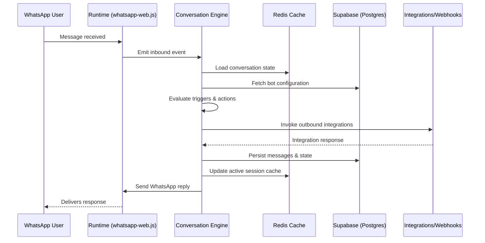

# Architecture Overview

## 1. Vision
The platform provides configurable WhatsApp bots built on top of `whatsapp-web.js`. Administrators onboard numbers, assemble reusable action flows, and publish them to be served by a Node.js runtime that manages WhatsApp sessions, executes actions, and captures structured data for downstream access.

## 2. High-Level Components
- **WhatsApp Runtime Service**: Node.js application embedding `whatsapp-web.js` + Puppeteer, loading bot configurations, processing inbound messages, orchestrating actions, and persisting conversation data.
- **Admin API**: REST interface backing the admin web UI; handles authentication, bot configuration CRUD, session lifecycle operations, analytics queries, and integrates with the runtime via shared databases/message queues.
- **Admin Web UI**: React (or similar) single-page app allowing non-technical users to manage numbers, build flows, preview conversations, and monitor health metrics. Component layer built with shadcn UI (Tailwind + Radix primitives) so we get accessible defaults with in-repo source for customization. Form-style previews are rendered locally in the builder using the persisted draft configuration and `ui_schema` hints—no runtime calls are required—so admins can confirm layout and copy instantly. A future “simulate conversation” action can be layered on as a separate runtime-backed feature.
- **Supabase (Postgres)**: Managed Postgres for configurations, session metadata, conversation state snapshots, audit logs, and RBAC data. Optionally use Supabase Auth; otherwise treat it as managed Postgres only.
- **Redis**: Ephemeral cache for active conversation state, rate limiting counters, and distributed locking around Puppeteer actions.
- **Session Storage**: Encrypted persistent volume holding WhatsApp session files (auth keys, Chromium profiles); metadata tracked in Postgres.
- **Analytics/Data Lake (optional initial scope)**: Append-only store (S3 parquet or warehouse) receiving structured events for reporting and BI without taxing the operational DB.
- **Observability Stack**: Centralized logging and metric collection (hosted service or minimal Prometheus/Grafana), alerting on connectivity, throughput, and resource utilization.

## 3. Runtime & Hosting Topology
- Containerize runtime and admin services with Docker. Ship images containing headless Chromium dependencies and PM2 as process supervisor.
- Recommended hosting: managed container platform (AWS ECS Fargate or DigitalOcean Apps) for stateless services; mount encrypted volumes for session artifacts.
- Use Supabase for managed Postgres. Enable connection pooling (pgBouncer) and select a region near the runtime to minimize latency. Provision managed Redis (e.g., Elasticache or Upstash) to minimize operational burden.
- Reverse proxy (Traefik/Nginx) terminates TLS, forwards webhook traffic to the runtime service, and serves the admin UI/API.
- Health-check endpoints expose service readiness and WhatsApp session status to orchestrator and monitoring tools.

## 4. Data & Control Flows
1. **Admin Workflow**
   - Admin authenticates via web UI → Admin API issues JWT.
   - Admin registers number → runtime exposes QR code → admin scans to establish session. Session metadata stored in Postgres; session files persisted on encrypted volume.
   - Admin composes bot configuration (triggers, actions, responses) → Admin API validates schema → stores versioned configuration in Postgres (JSONB payload) and marks as draft/published.
   - Admin opens preview within the builder → Admin UI rehydrates the most recent draft configuration and renders it in a read-only mode using shared form components and `ui_schema` hints. Nothing is sent to the runtime; the goal is a fast visual check before publishing.
2. **Message Handling**
   - WhatsApp user sends message → `whatsapp-web.js` emits event to runtime.
   - Runtime loads configuration from in-memory cache (backed by Postgres) → evaluates triggers → progresses through action steps.
   - Conversation state stored/updated in Redis; checkpoints written to Postgres for durability.
   - Actions may invoke downstream integrations (webhooks, CRM APIs). Results persisted alongside conversation logs.
   - Replies sent back through `whatsapp-web.js`; outbound messages logged and optionally mirrored to analytics sink.
3. **Data Access**
   - Admin UI fetches conversation transcripts, metrics, and action outputs via Admin API, which queries Postgres or analytics store depending on granularity.
   - Scheduled exports or API access deliver structured data to external systems with proper authorization.

### Message Flow Sequence

## 5. Environments
- **Local**: Docker Compose stack with runtime, Postgres, Redis, admin UI. Developers authenticate a sandbox WhatsApp account via QR code. Sample data seed scripts for configurations and actions.
- **Staging**: Single container instance tied to dedicated staging WhatsApp number. Mirrors production schema; restricted access for QA and acceptance testing.
- **Production**: Horizontal scaling by provisioning one runtime container per active number (or sharded per cluster). Separate Postgres schema/DB and Redis namespace. Sessions backed up regularly and access controlled.

## 6. Secrets & Configuration
- Secrets stored in centralized manager (AWS Secrets Manager, Doppler). Services fetch on startup and refresh periodically.
- `.env.example` documents non-secret defaults; runtime reads environment variables for DB URLs, Redis endpoints, secrets manager references, and feature flags.
- Supabase connection details managed via secrets (service role key for server-side, anon key for public UI if Supabase Auth is used). If using Supabase Auth with RLS, document policies; otherwise connect with service role and enforce RBAC in the Admin API.
- WhatsApp session files encrypted at rest; rotation procedures documented (see admin playbooks).

## 7. Security & Compliance
- Enforce RBAC in admin UI/API (admin vs editor vs viewer). Maintain audit log tables capturing CRUD operations and deployments.
- Encrypt data in transit (TLS) and at rest (managed services default + encrypted volumes).
- Define retention policies for PII collected in conversations; include anonymization/masking for analytics exports.
- Document incident response and access review cadences.

## 8. Monitoring & Reliability
- Centralized logging (e.g., CloudWatch, Logtail) capturing runtime events, Puppeteer errors, and integration failures. Review Supabase project logs/metrics for DB-side visibility (connections, slow queries, storage growth).
- Metrics: message throughput, response latency, active sessions, number of disconnects, queue depths, resource utilization. Alert on session disconnects and WhatsApp throttling.
- Uptime checks on webhook endpoints (Healthchecks.io or similar) and scheduled synthetic conversations to verify flow integrity.
- Automated backups via Supabase (point-in-time where available) and encrypted snapshots of session storage; test restore process quarterly.

## 9. Future Considerations
- Evaluate multi-tenant isolation strategies as customer count grows (dedicated schemas vs separate DB instances).
- Introduce message queue (e.g., RabbitMQ/SQS) if action workloads become asynchronous or require retries beyond Redis.
- Expand analytics pipeline with event streaming (Kafka) for real-time dashboards.
- Consider fallback provider integration (Meta Cloud API) if `whatsapp-web.js` limitations or compliance needs change.
- Plan for vendor flexibility: prefer standard SQL features; avoid tight coupling to Supabase-only capabilities unless strategically beneficial. Maintain migration scripts to portable Postgres.
